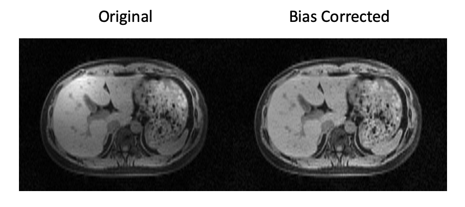

# N4-Biascorrection Matlab

## Description

This repo contains the source code for the N4BiasCorrection functionality that is to be called from matlab 
as a matlab executable. 

This code provides an MATLAB C++ interface to call N4BiasCorrection implemented by [[SimpleITK](https://simpleitk.readthedocs.io/en/master/link_N4BiasFieldCorrection_docs.html)]([Source](https://github.com/SimpleITK/SimpleITK))


## Building The Executable [MEX](https://www.mathworks.com/help/matlab/matlab_external/build-c-mex-programs.html) 

1. git clone the [SimpleITK project](https://github.com/SimpleITK/SimpleITK) and compile following the [official doc](https://simpleitk.readthedocs.io/en/master/building.html). The functionalities of this repo requires the compiled libraries from the [SimpleITK project](https://github.com/SimpleITK/SimpleITK).

2. Clone this repo and in [CMakeLists.txt](./CMakeLists.txt), modify the variables `SimpleITK_DIR` and `ITK_DIR`. 
> If you built your SimpleITK using the super build example provided by their official document, these two variables should point to the **`SimpleITK-build/`** folder and the **`ITK-build/`** folder. You should be able to find the files **`SimpleITKConfig.cmake`** and **`ITKConfig.cmake`** respectively in these folders. See [this tutorial](https://simpleitk.readthedocs.io/en/master/link_CppCMake_docs.html) on how to configure Cmake for building SimpleITK applications.


3. Load required modules and run cmake. 
```bash 
module load gcc/11.3.0 #gcc/11.3.0 is required
module load cmake
cmake . -DCMAKE_C_COMPILER=/spack/apps/gcc/11.3.0/bin/gcc -DCMAKE_CXX_COMPILER=/spack/apps/gcc/11.3.0/bin/g++
```
4. Compile
```bash
cmake --build . --config Release
```


## Running N4BiasCorrection in Matlab on USC CARC

`gcc/11.3.0` is required to run the compuliled mex in matlab.

Enviroment variable `LD_PRELOAD` needs to be properly set.

```bash
module load gcc/11.3.0
export LD_PRELOAD="/spack/apps/gcc/11.3.0/lib64/libstdc++.so.6"
```

Make sure the compiled executable is in matlab's search path. 

```matlab
[corrected_image, log_bias_field] = N4BiasCorrection(image);
```

This function supports only non-conplex 2D and 3D images with data type float(single) and double.

## Demo


